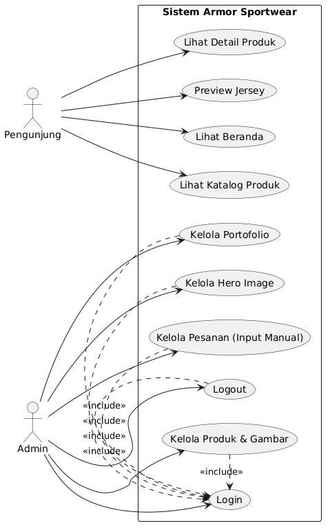
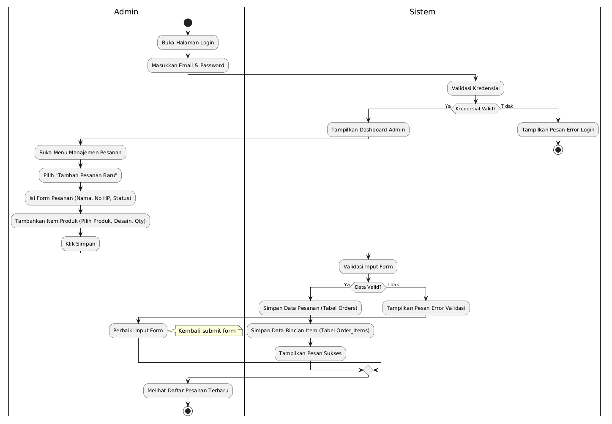
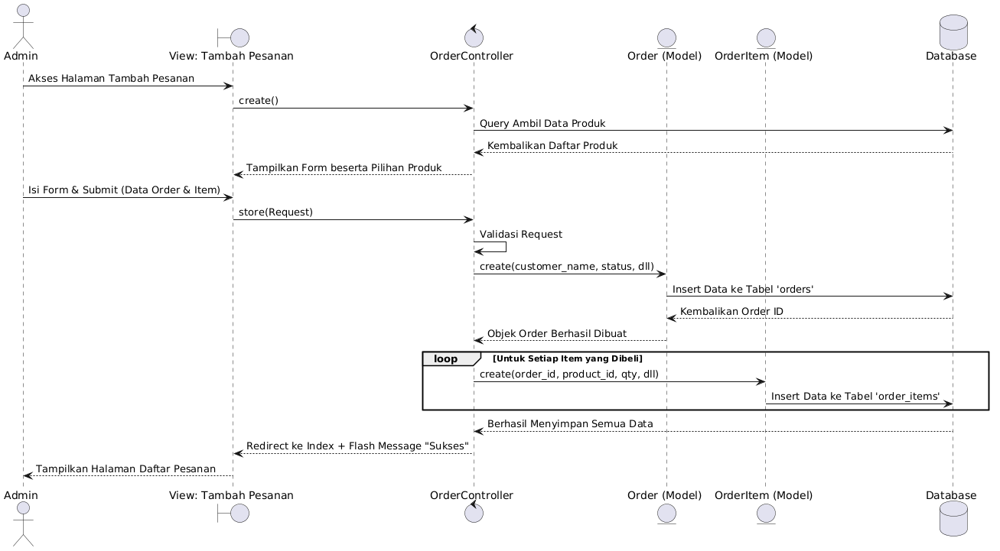
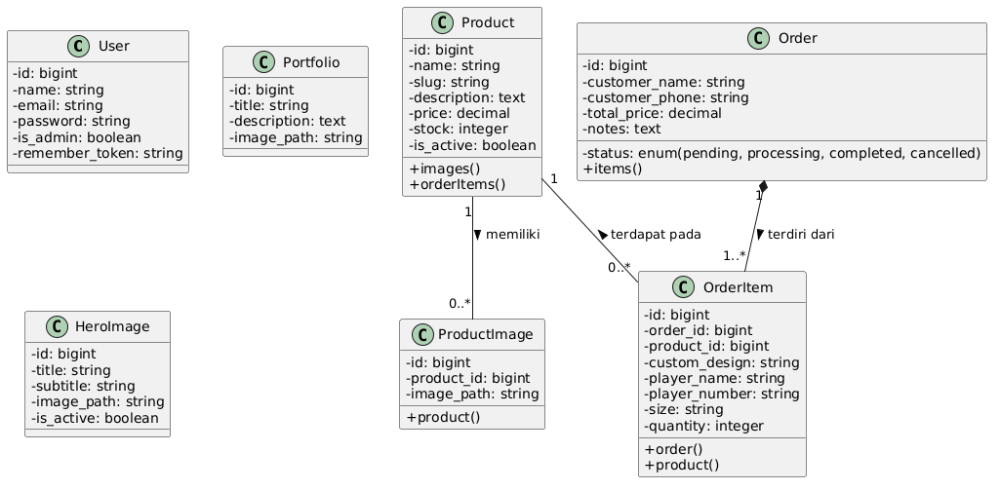
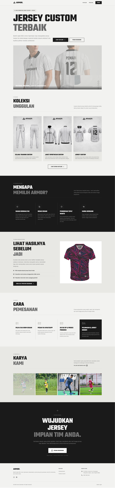
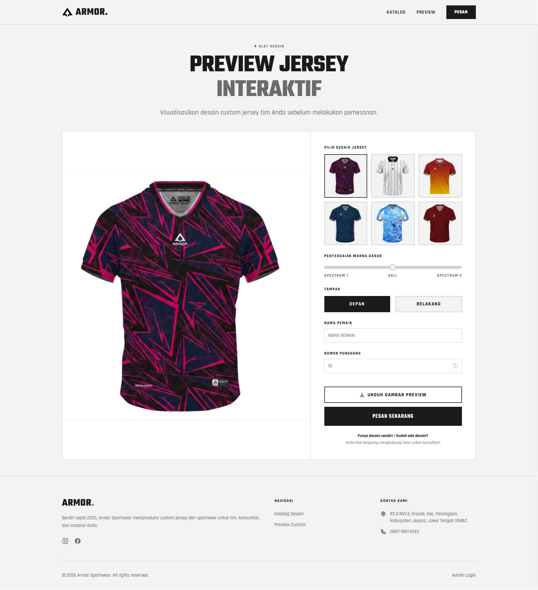
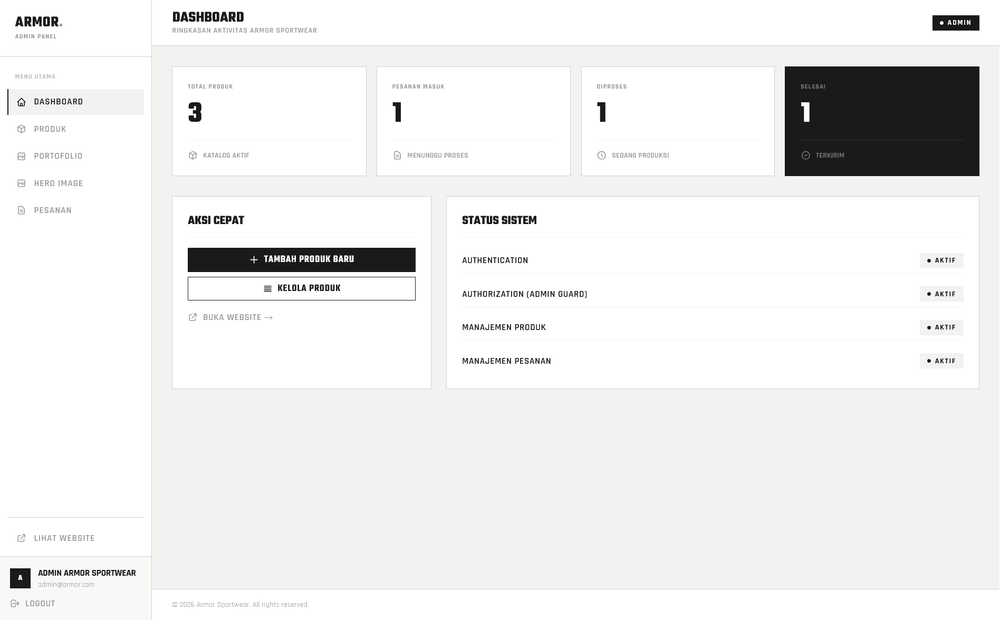

# Armor Sportwear - E-Commerce Web Application

**Tugas Akhir Mata Kuliah Rekayasa Perangkat Lunak (RPL)**

Armor Sportwear adalah aplikasi E-Commerce berbasis web yang dirancang sebagai katalog digital untuk menampilkan dan mengelola produk pakaian serta perlengkapan olahraga. Sistem ini dibangun menggunakan _framework_ Laravel dengan fokus pada manajemen konten terpusat oleh administrator dan presentasi produk yang interaktif bagi publik.

## Anggota Kelompok

-   Muhammad Fitrian Mubarok - 231240001402
-   Genard Arya Djaya - 231240001394
-   Muhammad Yunus - 231240001410

---

## Fitur dan Fungsionalitas

Berikut adalah fungsionalitas utama yang telah diimplementasikan pada sistem saat ini:

### 1. Antarmuka Publik (Pengunjung)

-   **Halaman Beranda (Home)**: Menampilkan _Hero Image_, galeri portofolio, dan deskripsi utama bisnis.
-   **Katalog Produk**: Menyajikan daftar keseluruhan produk yang tersedia beserta ringkasan informasi.
-   **Detail Produk**: Menampilkan spesifikasi dan deskripsi terperinci dari suatu produk yang dipilih.
-   **Preview Jersey**: Menyediakan fitur visualisasi khusus untuk melihat draf desain atau maket _jersey_.

### 2. Antarmuka Administrator (Dashboard)

Akses ke _dashboard_ diamankan melalui sistem autentikasi. Administrator memiliki hak akses untuk fungsi berikut:

-   **Manajemen Produk**: Mengelola data produk melalui fungsi _Create, Read, Update, Delete_ (CRUD) serta pengelolaan aset gambar produk terkait.
-   **Manajemen Portofolio**: Mengelola galeri portofolio karya dan pencapaian bisnis.
-   **Manajemen Hero Image**: Mengontrol konten dan aset gambar pada _banner_ halaman utama.
-   **Manajemen Pesanan (Order)**: Melakukan pencatatan dan pengelolaan transaksi secara manual, mencakup input rincian pelanggan, item pesanan, total harga, dan pembaruan status pesanan.

---

## Rencana Implementasi Algoritma

Sebagai bagian dari pemenuhan spesifikasi sistem yang membutuhkan algoritma khusus, aplikasi ini direncanakan untuk mengimplementasikan algoritma **Sequential Search** pada fitur penelusuran katalog.

**Skenario Penerapan:**
Sebuah kolom pencarian (_search bar_) akan ditambahkan pada antarmuka publik. Saat pengunjung memasukkan kata kunci berupa nama produk, sistem akan menjalankan algoritma _Sequential Search_ untuk melakukan iterasi pencarian secara sekuensial pada basis data produk. Algoritma akan mengevaluasi kecocokan setiap data dengan kata kunci yang diberikan sebelum menyajikannya sebagai hasil pencarian.

---

## Dokumentasi dan Artefak Perancangan

Berikut adalah dokumen dan artefak pemodelan sistem (UML) sebagai kelengkapan tugas Rekayasa Perangkat Lunak:

1. **Dokumen Analisis Kebutuhan**
   Dokumen ini memuat deskripsi sistem, identifikasi aktor, serta spesifikasi kebutuhan fungsional dan non-fungsional.

    - [Dokumen Analisis Kebutuhan (PDF)](docs/analisis_kebutuhan.pdf)

2. **Unified Modeling Language (UML)**
    - Use Case Diagram:
      
    - Activity Diagram:
      
    - Sequence Diagram:
      
    - Class Diagram:
      

---

## Tangkapan Layar Aplikasi (Screenshots)

-   **Halaman Beranda & Katalog Publik:**
    
-   **Halaman Preview Jersey:**
    
-   **Dashboard Admin (Kelola Produk & Pesanan):**
    

---

## Panduan Instalasi Sistem

Ikuti instruksi berikut untuk menjalankan aplikasi pada lingkungan _development_ lokal:

1. **Kloning Repositori**

    ```bash
    git clone https://github.com/rianmubarok/armor-sportwear
    cd armor-sportwear
    ```

2. **Instalasi Dependensi PHP**

    ```bash
    composer install
    ```

3. **Instalasi Dependensi Node.js**

    ```bash
    npm install
    npm run build
    ```

4. **Konfigurasi Lingkungan (Environment)**
   Salin berkas konfigurasi _environment_ dan sesuaikan kredensial basis data Anda:

    ```bash
    cp .env.example .env
    ```

5. **Pembuatan Kunci Aplikasi (Application Key)**

    ```bash
    php artisan key:generate
    ```

6. **Migrasi Basis Data dan Seeding**

    ```bash
    php artisan migrate --seed
    ```

7. **Tautkan Direktori Penyimpanan (Storage Link)**

    ```bash
    php artisan storage:link
    ```

8. **Menjalankan Server Development**
    ```bash
    php artisan serve
    ```
    Aplikasi publik dapat diakses melalui `http://localhost:8000`. Panel administrasi dapat diakses melalui rute `/login`.

    **Kredensial Default Administrator:**
    - Email: `admin@armor.com`
    - Password: `admin123`
